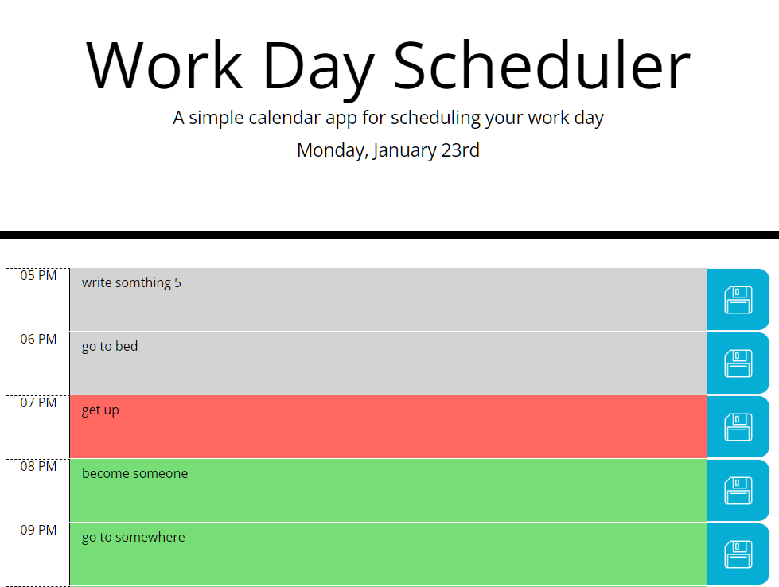

# Daily-Planner
Module 7 Challenge of FrontEnd BootCamp

## Task
Create a simple calendar application that allows a user to save events for each hour of the day by modifying starter code. This app will run in the browser and feature dynamically updated HTML and CSS powered by jQuery.

## Screenshots

## Deployment
- GitHub Repo: https://github.com/dearbojack/Daily-Planner
- GitHub Page: https://dearbojack.github.io/Daily-Planner
